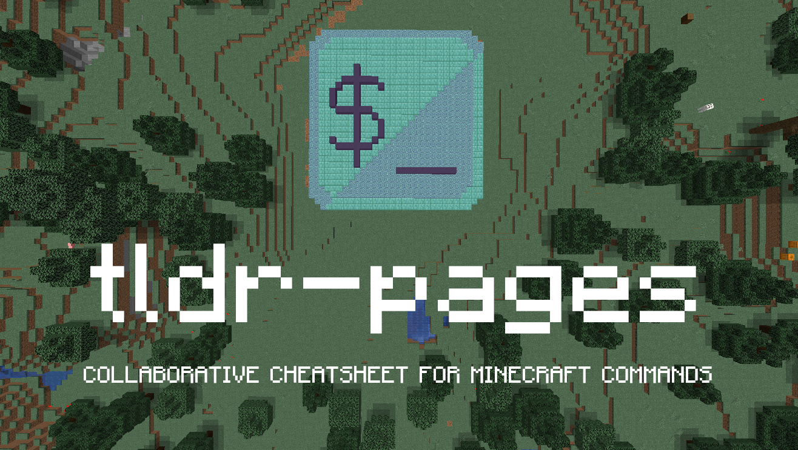

<h1></h1>

[![Build status][github-actions-image]][github-actions-url]
[![Gitter chat][gitter-image]][gitter-url]
[![Merged PRs][prs-merged-image]][prs-merged-url]
[![GitHub contributors][contributors-image]][contributors-url]
[![license][license-image]][license-url]

[github-actions-url]: https://github.com/Yutyo/tldr-mc/actions
[github-actions-image]: https://img.shields.io/github/workflow/status/tldr-pages/tldr/CI.svg
[gitter-url]: https://gitter.im/tldr-pages/tldr
[gitter-image]: https://img.shields.io/badge/chat-on_gitter-deeppink
[prs-merged-url]: https://github.com/Yutyo/tldr-mc/pulls?q=is:pr+is:merged
[prs-merged-image]: https://img.shields.io/github/issues-pr-closed-raw/tldr-pages/tldr.svg?label=merged+PRs&color=green
[contributors-url]: https://github.com/Yutyo/tldr-mc/graphs/contributors
[contributors-image]: https://img.shields.io/github/contributors/tldr-pages/tldr.svg
[license-url]: https://github.com/Yutyo/tldr-mc/blob/master/LICENSE.md
[license-image]: https://img.shields.io/badge/license-CC_BY_4.0-blue.svg

## What is tldr-mc?

The **tldr-mc** is the Minecraft edition of [tldr-pages](https://github.com/Yutyo/tldr-mc), famous collaborative command-line cheatsheet project. The Minecraft edition aims to provide help pages for in-game commands from both vanilla version of the game and mods/plugins made for it.
